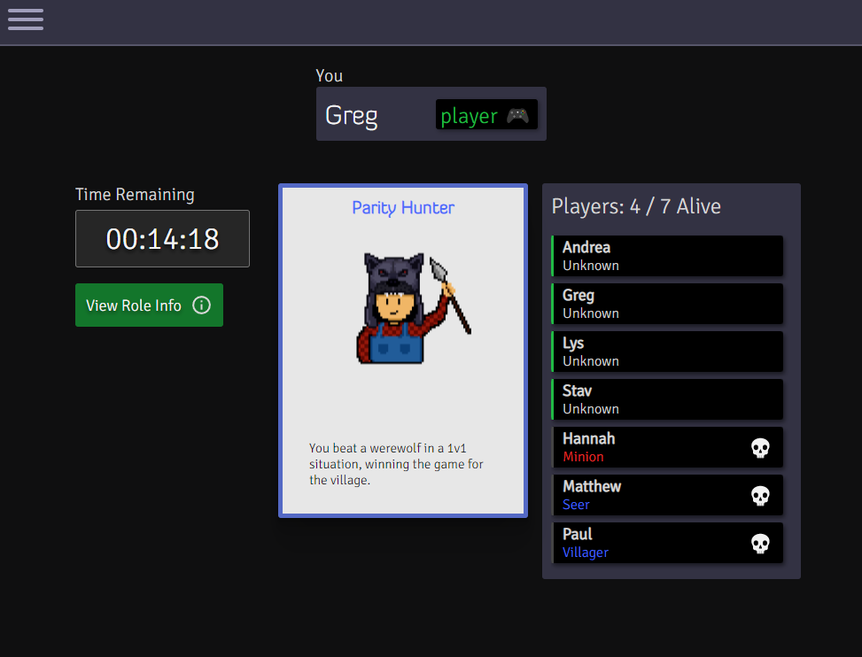

  

Find the latest production deployment at: https://play-werewolf.app/

- [Features](#features)
- [Tech Stack](#tech-stack)
- [Contributing and Developers' Guide](#contributing-and-developers-guide)
- [Testing](#testing)
- [Code Formatting](#code-formatting)

An application to run games of <a href="https://en.wikipedia.org/wiki/Mafia_(party_game)">Werewolf (Mafia)</a>
smoothly when you don't have a deck, or when you and your friends are together virtually. Basically, a host builds a game and deals a role to everyone's device, and then the app keeps track of the game state (timer, player statuses, etc). 

Inspired by my time playing <a href="https://boardgamegeek.com/boardgame/152242/ultimate-werewolf-deluxe-edition">Ultimate Werewolf</a> and by
2020's quarantine. The app is free to use, anonymous, and fully open-source under the MIT license. After a long hiatus I've rewritten a lot of the code and think this version works a lot better. This was (and still is) fundamentally a learning project, so feedback or assistance is appreciated.

  

  <kbd>
    
  </kbd>
  <kbd>
    
  </kbd>

## Features

You can:

- build your desired game with default or custom roles.
- join a game with two clicks via a shareable link, a 4-character code entered on the homepage, or by scanning a QR code.
- automatically deal cards to everyone's device.
- create a game as a "dedicated moderator", who is not dealt in, or as a "temporary moderator", who is dealt in and
  then has their powers automatically delegated. 
- transfer your mod powers to someone else that is out of the game if you can no longer mod.
- run a shared timer that can be paused by the moderator.
- reference helpful info during the game including what roles are in the game and who has been killed or revealed.
- choose to reveal a player without killing them, or kill them without revealing them. 
- restart the same game setup any number of times

This is meant to facilitate a game through a shared game state and various utilities - not to control
every aspect of the game flow i.e. it doesn't run day and night for you and doesn't implement any role abilities.

The application prioritizes responsiveness. A key scenario would be when a group is hanging out with only their phones.

## Tech Stack

This is a Node.js application. It is written purely using JavaScript/HTML/CSS. The main dependencies are
<a href="https://expressjs.com/">Express.js</a> and <a href="https://socket.io/">Socket.io</a>. It runs as a containerized application
via <a href='https://cloud.google.com/run'>Google Cloud Run</a>. There is no data persisted in any database. 

Currently there is one container instance, which is sufficient scaling at this time. In the event I need to scale to multiple containers, I will likely
integrate with a message queue like <a href='https://redis.io/'>Redis</a>.
## Contributing and Developers' Guide

### Running Locally

The entrypoint for the application is `index.js` at the root. 

If you haven't already, install <a href="https://nodejs.org/en/">Node.js.</a> This should include the node package 
manager, <a href="https://www.npmjs.com/">npm</a>.

Run `npm install` from the root directory to install the necessary dependencies.

These instructions assume you are somewhat familiar with Node.js and npm. At this point, we will use some of the run
commands defined in `package.json`.

If you simply want to run the app on the default port of **5000**:

`npm run start:dev` (if developing on a linux machine) 
`npm run start:dev:windows` (if developing on a windows machine)

This command uses <a href="https://www.npmjs.com/package/nodemon">nodemon</a>
to listen for changes to **server-side code** (Node.js modules) and automatically restart the server. If you do not want 
this, run instead `npm run start:dev:no-hot-reload` or `npm run start:dev:windows:no-hot-reload`. 

If you are making changes to client-side javascript, in a separate terminal, execute `npm run build:dev`. This uses <a href="https://webpack.js.org/">
Webpack</a> to bundle javascript from the `client/src` directory and place it in the `client/dist` directory, which is ignored by Git.
This command uses the `--watch` flag, which means the process will continue
to run in this terminal, watching for changes within the `client/src` directory and re-bundling automatically. You 
definitely want this if making frequent JavaScript changes to client-side source code. Any other changes, such as to HTML or CSS
files, are not bundled, and thus your changes will be picked up simply by refreshing the browser.

And there we go! You should be able to navigate to and use the application on localhost. There are additional CLI arguments
you can provide to the run commands that specify things such as port, HTTP vs HTTPS, or the log level. I **highly recommend**
consulting these below.

### CLI Options

These options will be at the end of your run command following two dashes e.g. `npm run start:dev -- [options]`.
Options are whitespace-delimited key-value pairs with the syntax `[key]=[value]` e.g. `port=4242`. Options include:

- `port`. Specify an integer port for the application.
- `loglevel` the log level for the application. Can be `info`, `error`, `warn`, `debug`, or `trace`. 
- `protocol` either `http` or `https`. If you specify HTTPS, the server will look in `client/certs` for localhost certificates
before serving the application over HTTPS - otherwise it will revert to HTTP. Using HTTPS is particularly useful if you
  want to make the application public on your home network, which would allow you to test it on your mobile device. **Careful -
  I had to disable my computer's firewall for this to work, which would of course make browsing the internet much riskier.**

## Testing

Tests are written using <a href="https://jasmine.github.io/">Jasmine</a>. End-to-end tests are run using <a href='https://karma-runner.github.io/latest/index.html'>Karma</a>.

Execute unit tests by running `npm run test:unit`. Execute end-to-end tests by running `npm run test:e2e`. 

Unit tests map 1:1 to the application directory structure - i.e. unit tests for 
`server/modules/GameManager` are found in `spec/unit/server/modules/GameManager_Spec.js`

## Code Formatting

This application uses <a href="https://eslint.org/">ESLint</a> to enforce code formatting standards. This configuration is found at the root in `.eslintrc.json`. 
To audit the codebase, run `npx eslint [directory]`, and to fix them along with that, run `npx eslint [directory] --fix`.
