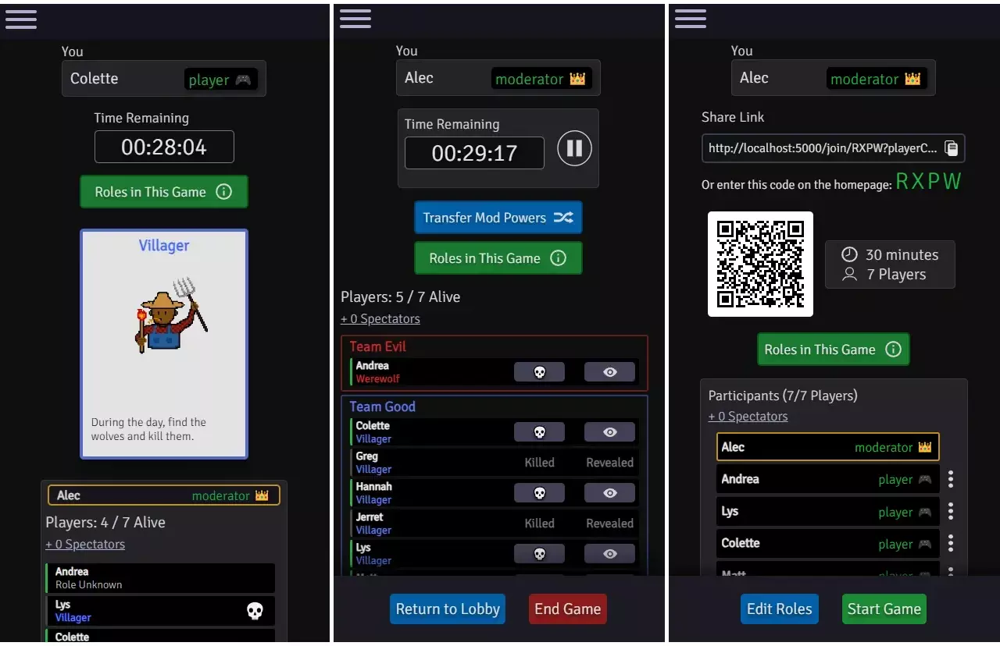

<p align="center">
  
</p>

[](https://github.com/AlecM33/Werewolf/actions/workflows/node.js.yml)
[](https://github.com/AlecM33/Werewolf/actions/workflows/codeql-analysis.yml)

Find the latest production deployment at: https://play-werewolf.app/

- [Overview](#overview)
- [Features](#features)
- [Tech Stack](#tech-stack)
- [Contributing and Developers' Guide](#contributing-and-developers-guide)
- [Testing](#testing)
- [Code Formatting](#code-formatting)

<p align="center">
    
</p>

## Overview

An app to create and run games of <a href="https://en.wikipedia.org/wiki/Mafia_(party_game)">Werewolf (Mafia)</a> with your friends. No sign-up, installation, or payment required. A moderator creates a room and deals a role to everyone's device, and then the app keeps track of the game state (timer, who is killed/revealed, etc). 
Since people tend to have their own preferences when it comes to what roles they use or how they run the game, the app tries to take a generalized, flexible, hands-off approach - it won't run day and night for you and won't implement any role abilities. Moderators can choose whether to be dealt in, and they can use any congifuration of roles they want, creating their own roles if needed.

The app prioritizes responsiveness. A key scenario would be when a group is hanging out with only their phones.

Inspired by my time playing <a href="https://boardgamegeek.com/boardgame/152242/ultimate-werewolf-deluxe-edition">Ultimate Werewolf</a> and by
2020's quarantine. After a long hiatus I've rewritten a lot of the code. This was (and still is) fundamentally a learning project, so feedback or assistance is appreciated.

## Features

- hosts can build their own game for any player count using default roles or custom roles that they create. They can include a timer, shared by everyone, that the moderator can play or pause.
- party members can join games easily via a shareable link, a QR code, or a 4-character code entered on the homepage.
- Players and spectators can freely leave the lobby, or the moderator can kick them. Roles can also be edited in the lobby. This should allow a room to be re-usable for several games, even if the player count changes
  and the moderator needs to change the cards in the game.
- When a moderator starts a game, cards are dealt randomly and automatically.
- players can reference helpful info, such as descriptions of all the roles in the game, the time remaining (if the host has set a timer), and who has been killed or had their role revealed.
- Moderators have the option to be dealt into the game, and will have their moderator powers automatically delegated to whoever they first remove from the game. Moderators can also transfer their powers to players that have been killed or to people that are spectating.
- The app is lightweight and loads fast. 

## Tech Stack

This is a Node.js application. It is written purely using JavaScript/HTML/CSS, with no front-end framework. The main dependencies are
<a href="https://expressjs.com/">Express.js</a>, <a href="https://socket.io/">Socket.io</a>, and <a href="https://www.npmjs.com/package//redis">Node-Redis</a>. It runs as a containerized application
via <a href='https://cloud.google.com/run'>Google Cloud Run</a>. 

Instances of this app are part of a stateless architecture that scales up and down as needed. Instances communicate with a separate <a href="https://redis.io/">Redis</a> datastore, sending/receiving client events using the <a href="https://redis.io/docs/manual/pubsub/">pub/sub model</a>. So, it does not matter which instance a given client connects to. Games are purged from Redis after a period of inactivity.

## Contributing and Developers' Guide

### Running Locally

The entrypoint for the application is `index.js` at the root. 

Before starting the Node.js server, you'll need a Redis server running locally on the default port. This is what's used 
to store active games and keep any number of Node.js servers in sync. I followed
<a href="https://www.sitepoint.com/using-redis-node-js/">this tutorial</a>, specifically using the installation method that uses
Windows Subsystem for Linux (WSL), since I am on a windows machine. In a powershell, I simply run `wsl` and then `redis-server`, at which point you should see something like the following startup logs.


I tested out the Redis server by using the Redis CLI
(see their <a href="https://redis.io/docs/getting-started/">getting started page</a>).

Once that's done, if you haven't already, install <a href="https://nodejs.org/en/">Node.js.</a> This should include the node package 
manager, <a href="https://www.npmjs.com/">npm</a>.

Run `npm install` from the root directory to install the necessary dependencies.

These instructions assume you are somewhat familiar with Node.js and npm. At this point, we will use some of the run
commands defined in `package.json`.

If you simply want to run the app on the default port of **5000**:

`npm run start:dev` (if developing on a linux machine)<br>
`npm run start:dev:windows` (if developing on a windows machine)

If everything is okay, you should see logs indicating a connection to Redis and a starting of the web server. 

This command uses <a href="https://www.npmjs.com/package/nodemon">nodemon</a>
to listen for changes to **server-side code** (Node.js modules) and automatically restart the server. If you do not want 
this, run instead `npm run start:dev:no-hot-reload` or `npm run start:dev:windows:no-hot-reload`. 

If you are making changes to client-side javascript, in a separate terminal, execute `npm run build:dev`. This uses <a href="https://webpack.js.org/">
Webpack</a> to bundle javascript from the `client/src` directory and place it in the `client/dist` directory, which is ignored by Git.
This command uses the `--watch` flag, which means the process will continue
to run in this terminal, watching for changes within the `client/src` directory and re-bundling automatically. You 
definitely want this if making frequent JavaScript changes to client-side source code. Any other changes, such as to HTML or CSS
files, are not bundled, and thus your changes will be picked up simply by refreshing the browser.

**Note:** in the development environment, cookies are stored using sessionStorage (vs. localStorage in production). This makes it a lot easier to create/run test games, as you can join as different people in different tabs.

### CLI Options

These options will be at the end of your run command following two dashes: `npm run start:dev -- [options]`.
Options are whitespace-delimited key-value pairs with the syntax `[key]=[value]` e.g. `port=4242`. Options include:

- `port`. Specify an integer port for the application.
- `loglevel` the log level for the application. Can be `info`, `error`, `warn`, `debug`, or `trace`. 
- `protocol` either `http` or `https`. If you specify HTTPS, the server will look in `client/certs` for localhost certificates
before serving the application over HTTPS - otherwise it will revert to HTTP. Using HTTPS is particularly useful if you
  want to make the application public on your home network, which would allow you to test it on your mobile device. **Careful -
  I had to disable my computer's firewall for this to work, which would of course make browsing the internet much riskier.**

example run command:

`npm run start:dev:windows -- port=4242 loglevel=trace protocol=https`
  
### Admin API

The app exposes an admin API at `/api/admin`, e.g. `localhost:5000/api/admin`.

The admin api doesn't require any authentication in the development environment (but does in prod).

Currently, the available operations are:

- **GET /games/state** - returns a JSON array of the currently existing games.

- **POST /sockets/broadcast** - broadcasts a message to all connected sockets. This is not currently handled on the front-end, so it will not display anywhere.

##### Example cURL
```
curl --location --request GET "http://localhost:5000/api/admin/games/state"
```

Have a question that isn't covered here? Email me at <a href="mailto:play.werewolf.contact@gmail.com?Subject=Werewolf App" target="_top">play.werewolf.contact@gmail.com</a>

## Testing

Tests are written using <a href="https://jasmine.github.io/">Jasmine</a>. End-to-end tests are run using <a href='https://karma-runner.github.io/latest/index.html'>Karma</a>.

Execute all tests by running `npm run test`. Execute unit tests by running `npm run test:unit`. Execute end-to-end tests by running `npm run test:e2e`.

Unit tests map 1:1 to the application directory structure - i.e. unit tests for 
`server/modules/GameManager` are found in `spec/unit/server/modules/GameManager_Spec.js`

## Code Formatting

This application uses <a href="https://eslint.org/">ESLint</a> to enforce code formatting standards. This configuration is found at the root in `.eslintrc.json`. 
To audit the codebase, run `npx eslint [directory]`, and to fix them along with that, run `npx eslint [directory] --fix`.
